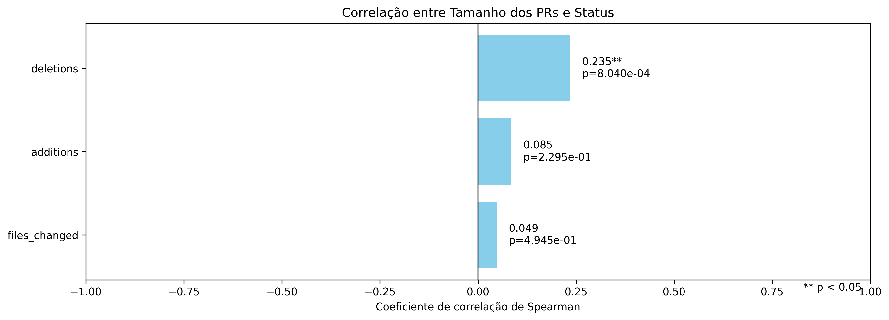
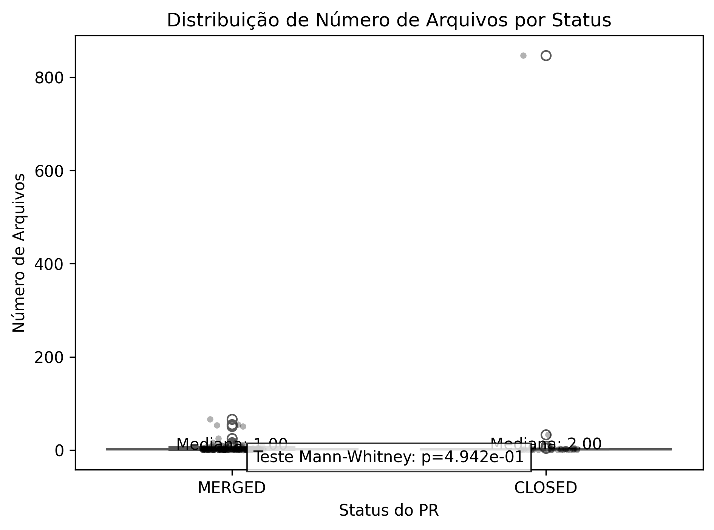
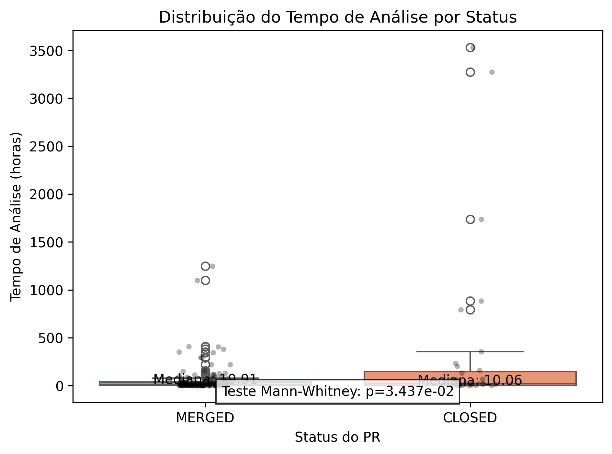
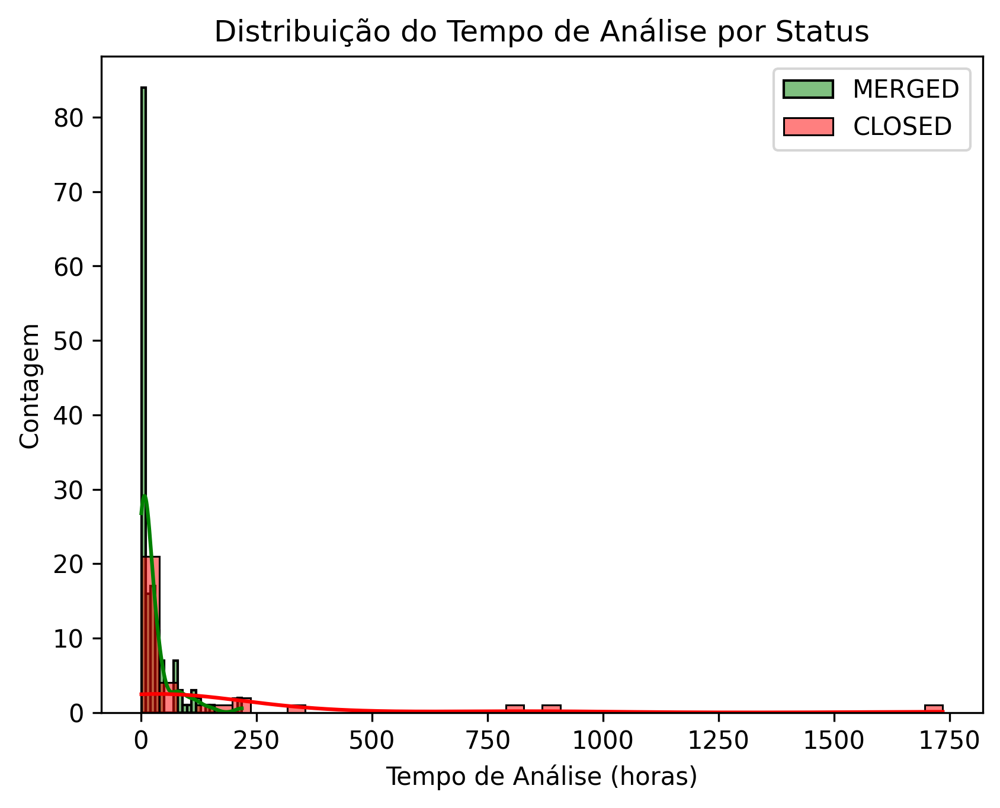

#📄 **Relatório de Análise da Atividade de Code Review no GitHub**

## 📋 **Introdução**

Este relatório apresenta os resultados da análise da atividade de code review em repositórios populares do GitHub. O objetivo é identificar variáveis que influenciam no merge de um PR, sob a perspectiva de desenvolvedores que submetem código aos repositórios selecionados.

### ✨ **Hipóteses Informais**

1. PRs menores têm maior probabilidade de serem aprovados. ✂️

2. PRs que levam mais tempo para serem analisados têm menor probabilidade de serem aprovados. ⏳❌

3. PRs com descrições mais detalhadas têm maior probabilidade de serem aprovados. 📑👍

4. PRs com mais interações têm maior probabilidade de serem aprovados. 💬🔄

5. PRs maiores requerem mais revisões. 📂🔍

6. PRs que levam mais tempo para serem analisados têm mais revisões. ⏱️🔄

7. PRs com descrições mais detalhadas têm menos revisões. ✍️📉

8. PRs com mais interações têm mais revisões. 💬🔄✅

## 🧑‍🔬 **Metodologia**

1. Coleta de dados: Selecionamos os 200 repositórios mais populares do GitHub com pelo menos 100 PRs (MERGED + CLOSED).

2. Filtragem dos dados: Selecionamos apenas PRs com status MERGED ou CLOSED, que possuíam pelo menos uma revisão e cuja análise levou pelo menos uma hora.

3. Análise estatística: Utilizamos o coeficiente de correlação de Spearman para analisar as relações entre as variáveis.

4. Interpretação dos resultados: Interpretamos os coeficientes de correlação conforme faixas de força e p-valores.

## 📊 **Resultados**

### RQ 01: Relação entre o tamanho dos PRs e o feedback final das revisões

**📏 Correlação entre métricas de tamanho e status:**

**📂 Correlação entre número de arquivos alterados e status:**

- Coeficiente de correlação: 0.0486

- P-valor: 4.9446e-01

- Interpretação: Insignificante

- Estatisticamente significativo: ❌ Não

### RQ 02: Relação entre o tempo de análise dos PRs e o feedback final das revisões

**⏱️ Correlação entre tempo de análise e status:**

- Coeficiente de correlação: -0.1501

- P-valor: 3.3897e-02

- Interpretação: Fraca

- Estatisticamente significativo: ✅ Sim

## 🔍 **Conclusão**

Este estudo analisou a relação entre diversas características dos PRs e seu feedback final, bem como o número de revisões realizadas.

Com base nos resultados, podemos sugerir boas práticas para submissão de PRs mais eficazes.
